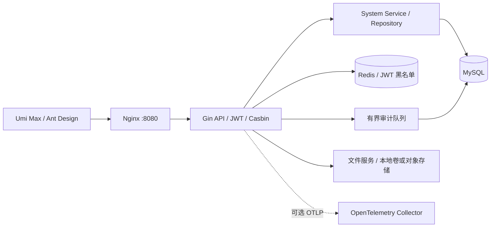

# Base Frame 架构评审与升级记录

评审日期：2026-09-10。范围：`base-frame` 分支的 CMS 前后端、数据访问、鉴权、可观测性、依赖和 Docker 部署。本轮先落实基础修复，Nexus 业务模块保持独立设计。

## 架构判断

**继续采用模块化单体，适合当前小团队和单台服务器。** Gin + GORM + Umi Max 可以支撑管理平台，无须为了调度平台改成 Python，也无须提前引入微服务或 Kubernetes。

当前分层为 Router → API/DTO → Service → Repository → DB，构造入口集中在 `internal/core/server/router.go`。系统模块、通用基础设施和部署代码已有基本边界。主要不足是：部分“已有功能”缺少完整的运行与验证闭环，以及模板带来的多余依赖。

业务菜单、路径、图标、排序和权限仍由后端返回。前端 `componentMap` 只维护允许加载的页面组件，静态路由只保留登录等公共页面及布局骨架。后端菜单不能直接变成任意代码或任意模块路径。

目录组织的现状、已完成清理和推荐演进见 [目录结构与模块边界](DIRECTORY_STRUCTURE.md)。

## 本轮已完成

| 领域 | 发现的问题 | 实际改进 |
|---|---|---|
| 操作审计 | 请求与响应完整读入内存；密码重置、用户创建和令牌签发可能留下敏感值 | 以流式方式捕获最多 8 KiB + 1 字节，完整 JSON 按敏感字段递归脱敏；过大、非 JSON 和残缺 JSON 不保存内容；业务请求和响应保持完整 |
| 既有数据 | 仅修中间件无法处理历史日志 | 新增一次性版本迁移 `20260910_redact_audit_bodies`，分批清理历史 body/resp，保留操作记录与非敏感 JSON 字段；新建库也会登记该版本 |
| 审计可靠性 | 发送与关闭并发可能 panic，重复 Close 不安全，数据库写入没有期限 | 队列容量降为 1024；关闭幂等；单批写入 3 秒期限；关闭超时取消后台写入；丢弃计数 `cms.audit.dropped` 与结构化告警 |
| SQL 观测 | SQL 日志和数据库 span 可能包含绑定参数 | GORM 日志保留占位符；otelgorm 禁止写入查询变量；请求日志不再附带完整 query string |
| 生命周期 | SQL 连接池未关闭；初始化失败没有统一回收；Casbin 全局单例与 panic 不利于测试和恢复 | 资源按创建的相反顺序关闭，先停 HTTP、审计与权限轮询，再关数据库，最后刷新遥测；初始化失败回收已创建资源；Casbin 改为实例构造并返回错误 |
| 健康检查 | 进程存活并不代表能够处理请求 | `/health` 表示存活，`/ready` 在 2 秒预算内验证 SQL 和配置启用的 Redis/Mongo；失败返回 503，不泄露连接详情；探针绕过业务限流和熔断，Docker 健康检查改用 `/ready` |
| HTTP | 没有独立请求头和空闲连接期限 | 增加 ReadHeaderTimeout 5 秒和 IdleTimeout 60 秒；长操作需要异步任务，不依赖长 HTTP 请求 |
| 链路/日志 | 缺少 W3C 传播；自写日志桥的数值转换存在错误，新 OTel API 也不兼容 | 注册 Trace Context / Baggage；使用官方 `otelzap` 桥关联上下文和字段；移除未接入的重复 HTTP 指标实现，由 otelgin 统一采集 |
| 分页 | 用户、API 和审计列表直接信任 pageSize，公共分页限制未实际使用 | API 响应与仓库使用统一 Normalize/Paginate，默认 10、上限 100，并防止 offset 整数溢出；权限/API/通知用户选择器改为逐页加载全部选项 |
| 权限数据 | GORM Updates 修改 oldApi 后，后续逻辑丢失旧 API 路径与方法 | 更新前保存旧标识，使 API 改名时同事务内的 Casbin 规则同步生效 |
| JWT | 解析没有要求 expiry，也未显式固定签名算法和 issuer | 只接受 HS256、本服务 issuer 和带过期时间的令牌 |
| 前端续期 | Axios 响应头不是 Fetch Headers 时，new-token 被忽略 | 兼容 AxiosHeaders、Fetch Headers 和普通头对象；只为同源 `/api/` 请求附加和更新令牌 |
| 菜单视觉 | 折叠后的悬浮菜单中图标容器与文本行高不同，出现上偏 | 图标及标签容器使用明确的 flex 居中；浏览器回归直接比较各图标和文字的垂直中心 |
| 构建与依赖 | IE11 目标与 React 19 不匹配；保留地图、图表、Petstore 与模板工具 | 采用现代浏览器目标；移除未使用依赖和示例 OpenAPI 客户端/配置；Docker 先安装依赖、后复制源码，提高缓存复用 |
| 工程检查 | 质量文档声称存在 CI，实际没有 workflow | 新增后端测试/vet/并发检测/漏洞检查、前端类型/单测/构建、独立数据库的浏览器 CI；npm 上游审计报告作为构建产物保存 |

审计队列仍然是**尽力保存**，数据库不可用或队列饱和会丢弃并计数。Nexus 的任务状态、case 结果和 agent 决策历史必须使用数据库持久化，不能复用这个审计队列。

## 技术栈决策

下表按本轮开始时的实际锁文件版本比较，而不是把 package.json 中的最低版本当成运行版本。

| 项目 | 原实际版本 | 本轮结果 | 说明 |
|---|---|---|---|
| Go | 1.25.2 | **1.27.1** | go.mod、Docker 与 CI 对齐 |
| Node 构建环境 | 22.x | **24.21.0 LTS** | Docker、.nvmrc、engines 与 CI 对齐；开发机全局 Node 未替换 |
| Umi Max | 4.7.16 | **4.7.16** | 已是查询时最新稳定版；提高 manifest 下限，清除无用 Pro preset |
| React / React DOM | 19.3.0 | **19.3.0** | 已是查询时最新稳定版 |
| Ant Design | 5.29.3 | **5.29.3** | 最新主版本为 6.6.3，但 Pro Components 2.8.10 声明只兼容 AntD 4/5 |
| Pro Components | 2.8.10 | **2.8.10** | 动态菜单和展开/折叠场景保持浏览器回归 |
| TypeScript | 5.9.3 | **5.9.3** | 暂缓直接跳到 7.x，先保证 Umi 插件和类型工具链兼容 |
| Jest / jsdom 环境 | 30.5.1 / 29.7.0 | **30.5.1 / 30.5.1** | 主版本对齐；显式声明测试实际使用的 Babel 插件 |
| Gin | 1.11.0 | **1.12.0** | API 行为回归 |
| GORM | 1.31.1 | **1.31.2** | 同步更新 PostgreSQL、SQLite 驱动 |
| Casbin / GORM adapter | 2.134.0 / 3.38.0 | **3.11.0 / 3.41.0** | 新 adapter 使用 Casbin 3，源码和依赖图统一到同一主版本 |
| go-redis / redisotel | 9.17.2 | **9.22.0** | 客户端与 instrumentation 对齐 |
| OpenTelemetry | 1.38.0 / Logs 0.14.0 | **1.46.0 / Logs 0.22.0** | 配套 instrumentation 与官方 Zap bridge 一并更新 |
| JWT | 5.3.0 | **5.3.1** | 同时强化解析约束 |
| Zap | 1.27.1 | **1.28.0** | 跟随官方桥更新 |
| MinIO Go SDK | 7.0.97 | **7.3.0** | 本地文件路径已验证；真实 MinIO 需要对应集成环境 |
| Mongo Go Driver | 1.17.6 | **1.17.9** | 更新 v1 补丁以修复漏洞；qmgo 仍依赖 v1，暂不混用 v2 API |
| gRPC / golang.org/x | 多个旧版本 | 同步更新 | 具体版本见 go.mod/go.sum |

前端使用定向 overrides：Axios 0.x → 0.33.0、path-to-regexp 1.x → 1.9.0 / 8.x → 8.4.2、dva-immer 的 Immer → 9.0.21。这些处理解决旧传递依赖的已知问题，保留其调用接口；后续上游修复后应移除覆盖并重新回归。

MySQL 容器仍为 8.0，Redis 服务仍为 7.4。**数据库引擎大版本升级应先在复制的数据卷上演练**，与 Go 客户端更新分开交付。建议下一步验证 MySQL 8.4 LTS 的备份恢复、迁移和回退流程；不直接用新镜像打开唯一的旧数据卷。数据库备份已在本机私有 runtime 目录保留。

版本来源：

- [Go releases](https://go.dev/dl/?mode=json)、[Node releases](https://nodejs.org/dist/index.json)
- [Umi registry](https://registry.npmjs.org/@umijs%2fmax/latest)、[React registry](https://registry.npmjs.org/react/latest)
- [AntD registry](https://registry.npmjs.org/antd/latest)、[Pro Components 与 peer dependencies](https://registry.npmjs.org/@ant-design%2fpro-components/latest)
- Go module 版本使用 [Go module proxy](https://proxy.golang.org/) 核对；漏洞来源为 npm audit 和 [Go vulnerability database](https://vuln.go.dev/)。

## 仍值得改进的部分

这些是本轮检查发现但尚未完成的后续工作，不代表当前基础框架已全部具备。

| 优先级 | 现状与影响 | 建议 |
|---|---|---|
| P1：会话撤销 | JWT 携带签发时的用户/角色；当前只检查 token 有效性和黑名单，禁用用户、删除用户或重置密码不会统一撤销所有旧会话 | 增加服务端 session/token-version，逐请求验证当前用户状态与权限版本；补齐改密、禁用、删除和角色变更回归 |
| P1：权限一致性 | Casbin 的数据库、缓存和自动加载存在多个更新入口；API 更新事务已修复，但“授权撤销立即生效”仍需单独验证 | 统一策略更新服务，明确缓存失效；单实例先同步刷新，多实例再引入 watcher/版本号 |
| P1：开户策略 | 仍有公开注册入口，适用于通用模板，但团队内部平台通常只需管理员创建账号 | Nexus 分支将公开注册设为配置开关，默认关闭，并同步登录 UI |
| P1：数据恢复 | 已有持久卷和本次手工备份，缺少定时备份、保留策略与恢复演练 | 对 MySQL、上传文件和配置分别备份；定期用新卷恢复并跑 smoke，之后再迁移 MySQL 8.4 |
| P1：迁移治理 | 启动时 AutoMigrate 与 seed 可以反复执行；已有版本迁移，但不适合多个实例同时修改 schema | 独立 migrator 作业、迁移锁与版本校验；业务字段调整走版本脚本；seed 仅补缺省项，避免覆盖管理员编辑 |
| P1：可观测运行闭环 | 有 OTLP 导出能力，但本地部署 `exporter: none`，没有随 CMS 启动仪表盘、持久化查询后端和告警 | 增加可选 Compose 观测配置，按团队已有产品接入 Collector + Grafana/Tempo/Loki 或同类方案；默认 CMS 保持轻量 |
| P2：配置一致性 | Viper 监听文件变化只打印消息，已构造的连接池、JWT 等不会随之更新 | 明确静态配置重启生效；可动态调整的配置通过专门接口原子更新，避免宣称全面热加载 |
| P2：数据约束 | 多种数据库驱动均存在，部分查询和迁移依赖具体方言；自动迁移禁用外键，关联完整性主要由业务维护 | 定义 MySQL 主支持矩阵；PostgreSQL 增加真实数据库集成测试；保留 SQLite 做快速测试；为关键关联和唯一性建约束 |
| P2：可扩展性 | service 层普遍持有整个 ServiceContext；模块增多后依赖会变得模糊 | 新模块构造函数仅注入需要的 repository、clock、queue、file store 等接口；可逐模块收窄，无须一次重写 |
| P2：过载保护 | 全局 HTTP 熔断会把不同接口的错误汇总；限流、API token 并发计数是单进程状态 | 将熔断放到外部执行器/供应商调用；针对登录、下载、任务提交分别限流；扩容时采用共享配额 |
| P2：前端收敛 | 模板页面与 mock 已清理，接口类型仍以手写和全局 API namespace 为主 | 逐业务模块收敛类型；由本仓库 Swagger 生成或校验 API 类型，避免引用外部样例 schema |
| P2：可追踪业务数据 | 操作日志记录的是 HTTP 修改动作，缺少任务级关联、阶段状态和进度事件 | Nexus 模块建立 run_id/round_id/case_id/agent_attempt_id；日志、trace、结果使用同一组关联 ID |

## Nexus 分支建议

保持 `base-frame` 提供通用 CMS；在业务分支新增 bench、run、round、case-result、agent-attempt 和 artifact 模块。

- **平台 API**：提交、取消、重试、权限检查、配置快照；提交后立即返回 run_id。
- **调度器**：持久化任务状态、租约、心跳、超时、幂等键；明确可重试和不可重试错误。
- **独立 worker**：调用 Nexus 执行器；排查、修复、评测可以分配不同 agent；worker 重启可恢复任务。
- **数据**：MySQL 保存事实记录和状态变更，产物进文件卷/对象存储；Redis 用于加速与协调，不能作为唯一结果存储。
- **进展 UI**：同一 bench 下组织多次 run 和各轮 round；通过 SSE 推送事件并保留查询接口用于断线恢复。
- **停止条件**：所有 case 正常执行且评测通过为成功；还须配置最多轮数、时间/费用预算、人工暂停和卡住检测。不能把“持续尝试直到 100%”实现为没有边界的死循环。

第一阶段可采用 MySQL 任务表 + 事务领取/租约 + 一个独立 worker 进程。待并发和可靠性需求明确后再选择 Redis Streams 或专门工作流系统。

## 验证与实际边界

本轮后端全量测试、go vet、审计/中间件 race 检测均通过；前端类型检查及 18 项单元测试通过。独立数据库的 7 个 Playwright 场景全部通过（含悬浮图标对齐），共享 8080 部署的登录、动态菜单、就绪检查与上传下载 smoke 通过，四个容器健康，数据库仍仅有 admin 一个用户。细节见 `TEMPLATE_QUALITY.md`。回归覆盖审计脱敏/流式透传/并发关闭、分页、权限规则同步、JWT 约束、OTLP HTTP 的 trace/metrics/logs 导出、动态路由和悬浮菜单几何对齐。

2026-09-10 的 npm audit：全部依赖从 **136 项 → 37 项**，其中 critical 从 **13 → 0**、high 从 **66 → 5**；剩余 high 位于 Umi 的 Less/image-size 等构建依赖链，当前 registry 没有可直接采用的修复组合。`npm audit --omit=dev` 为 **0 项**，但 Umi 位于 devDependencies，它的部分依赖可能进入浏览器 bundle，因此不能据此断言全部浏览器代码零风险。未运行 `npm audit fix --force` 或为了通过审计降级核心 UI。

Go govulncheck 对当前可达调用路径的结果为 **0 个已知漏洞**；仍报告未被当前代码导入的 `golang.org/x/crypto/openpgp` 模块级问题（该包已弃用且无修复版本），需要随依赖维护继续跟踪。

运行与端到端验证主路径为 **MySQL + Redis + 本地上传**。PostgreSQL、MongoDB、MinIO 未连接真实外部服务做全面集成验收；OTLP 用本地测试接收器验证了三种信号和日志链路关联，尚未部署持久化观测平台。
